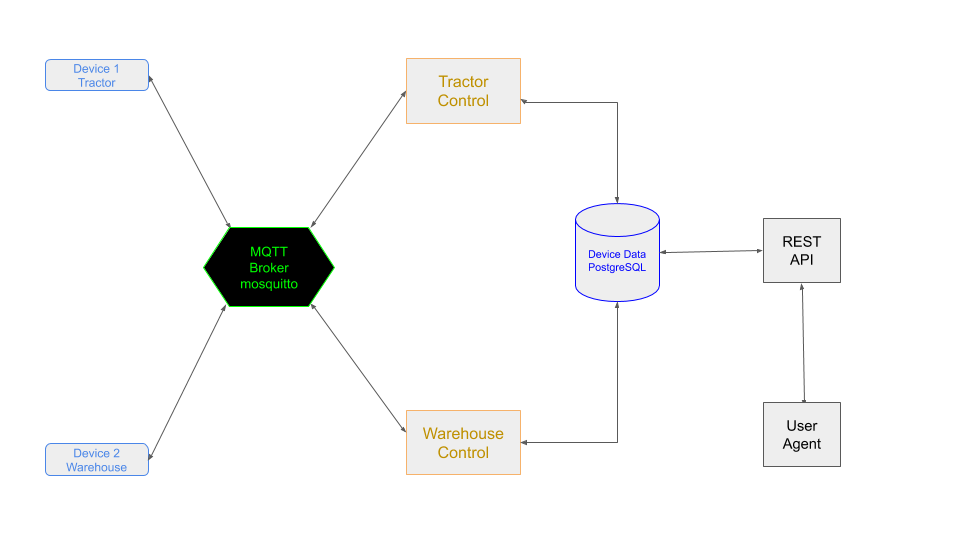

# Sample Project 1

This sample project is a mixed language IoT project example illustrating the use of mixed programming languages that could be used in developing micro services.

A set of simulated devices will send sensor data to subscribing MQTT broker controllers that imploy business logic to decide on actions to take by sending commands to the devices.

## Architecture

The following architecture will be used in the sample project:



Here we see the use of a message broker to facilite communication between two devices and their respective controllers.

## Deploy

To deploy the project you can install `docker-compose` and run:

```
make
```

This will build the sub-projects and will start the project containers on the current host running docker.

## Devices

### Tractor

This device type is a farm tractor consisting of a set of sensors.
The device will be a MQTT client and will connect to a preconfigured MQTT broker endpoint.

#### Implementation

The tractor device will be a simulated device written in NodeJS.
The simulator will run in a NodeJS docker container sending device sensor readings at a configured interval ( default 10 seconds ).

#### Publish Topics

The tractor device will publish to the following topics:

```
farm/tractor/<Device ID>/speed
farm/tractor/<Device ID>/wheel_position
farm/tractor/<Device ID>/engine_temp
```

The `Device ID` is unique to each device instance.

This device has the following sensor types:

* `speed` - Speed of tractor, measured in MPH
	* `0` - stopped
	* `> 0` - moving forward
	* `< 0` - moving in reverse
* `wheel_position` - Tractor wheels Position, measured in degrees
	* `0` - straight
	* `> 0' - right
	* `< 0` - left
* `engine_temp` - Tractor engine temperature, measured in degrees celcius

#### Subscribe Topic

The tractor device will also accept commands on the following subscription topics:

```
farm/tractor/<Device ID>/cmd/+
```

This device will accept the following commands:

* `speed` (Speed) - set the tractor speed to new value in MPH
* `wheel_position` (Wheel Position) - set the tractor wheel position in degrees
	* `0` - straight
	* `> 0`- right
	* `< 0` - left

### Refrigerator Warehouse

This device type is a farm refrigerated warehouse that can house farm products in a cooled environement.
The warehouse will consist of multiple sensors setup within the facility.

#### Implementation

The warehouse device will also be a simulated device written in NodeJS.
The simulator will run in a NodeJS docker container sending device sensor readings at a configured interval ( default 10 seconds ).

#### Publish Topics

The warehouse device will publish to the following topics:

```
farm/warehouse/<Device ID>/temp
farm/warehouse/<Device ID>/door_state
```

The `Device ID` is unique to each device instance.

This device has the following sensor types:

* `temp` - warehouse temperature, measured in degrees celcius
* `door_state` - main warehouse door state
	* `0` - closed
	* `1` - open

#### Subscribe Topics

The warehouse device will also accept commands on the following subscription topics:

```
farm/warehouse/<Device ID>/cmd/+
```

This device will accept the following commands:

* `refrigerator_temp` - sets the warehouse thermostate to the new value in degrees celcius

## Controllers

The following microservices will be hosted in the cloud to control the two types of devices.

### Tractor Control

This controller will manage all tractors connected to the MQTT Broker.
The controller will store the sensor data in a PostgreSQL relational database.

#### Logic

The controller will monitor the engine temperature and will stop the tractor if the temperature is above 100 celcius.
Also, every minute, rotate the wheels 45 degrees to the left for 20 seconds and then straighten the tractor out.

#### Subscribe Topics

The tractor controller will monitor tractor sensor readings at the following topics:

```
farm/tractor/#
```

The `#` topic level is a wildcard to accept readings from all tractors.

#### Publish Topics

```
farm/tractor/<Device ID>/cmd/speed
farm/tractor/<Device ID>/cmd/wheel_position
```

### Warehouse

This controller will manage all warehouses connected to the MQTT Broker.
The controller will store the sensor data in a PostgreSQL relational database.

#### Logic

If the door opens, the controller will lower the thermostat to -10 degrees.
If the door closes, the controller will raise the thermostat to 0 degrees

#### Subscribe Topics

The warehouse controller will monitor the warehouse sensor readings at the following topics:

```
farm/warehouse/#
```

#### Publish Topics

```
farm/warehouse/<Device ID>/cmd/refrigerator_temp
```

## License

Copyright 2020 Buffalo Iot

Permission is hereby granted, free of charge, to any person obtaining a copy of this software and associated documentation files (the "Software"), to deal in the Software without restriction, including without limitation the rights to use, copy, modify, merge, publish, distribute, sublicense, and/or sell copies of the Software, and to permit persons to whom the Software is furnished to do so, subject to the following conditions:

The above copyright notice and this permission notice shall be included in all copies or substantial portions of the Software.

THE SOFTWARE IS PROVIDED "AS IS", WITHOUT WARRANTY OF ANY KIND, EXPRESS OR IMPLIED, INCLUDING BUT NOT LIMITED TO THE WARRANTIES OF MERCHANTABILITY, FITNESS FOR A PARTICULAR PURPOSE AND NONINFRINGEMENT. IN NO EVENT SHALL THE AUTHORS OR COPYRIGHT HOLDERS BE LIABLE FOR ANY CLAIM, DAMAGES OR OTHER LIABILITY, WHETHER IN AN ACTION OF CONTRACT, TORT OR OTHERWISE, ARISING FROM, OUT OF OR IN CONNECTION WITH THE SOFTWARE OR THE USE OR OTHER DEALINGS IN THE SOFTWARE.
